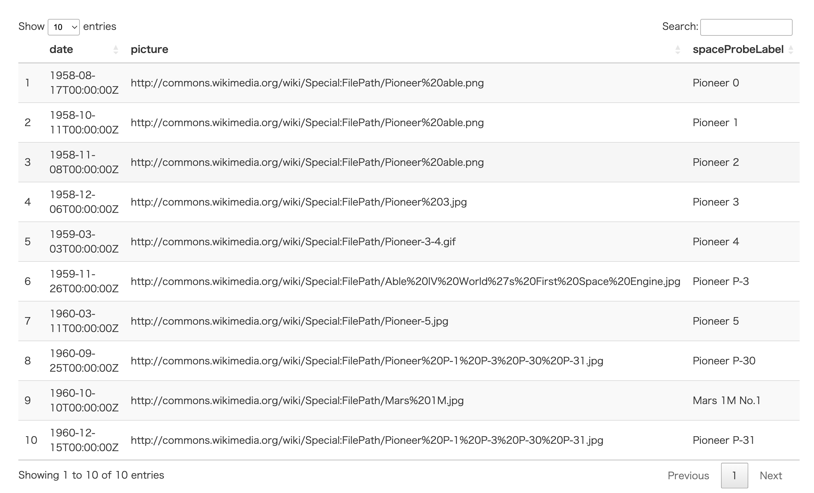

<!-- README.md is generated from README.Rmd. Please edit that file -->

# tansakusuR

A wrapper for SPARQL endpoints

## Installation

You can install the development version of “tansakusuR” from
[GitHub](https://github.com/UTNAK/tansakusuR) with:

``` r
library(devtools)
install_github("UTNAK/tansakusuR")
```

## Usage

``` r
library(tansakusuR)
endpoint_url <- "https://query.wikidata.org/sparql"


query_string <-'
SELECT ?spaceProbeLabel ?date ?picture
WHERE
{
  ?spaceProbe wdt:P31 wd:Q26529;
        wdt:P18 ?picture;
        wdt:P619 ?date . #mandatory
  SERVICE wikibase:label {
    bd:serviceParam wikibase:language "fr,en" .
  }
}
ORDER BY ?date
LIMIT 10
'

df <- send_query(endpoint_url, query_string)
```

Here is the queried result

``` r
df
#> # A tibble: 10 × 3
#>    date                 picture                                  spaceProbeLabel
#>    <chr>                <chr>                                    <chr>          
#>  1 1958-08-17T00:00:00Z http://commons.wikimedia.org/wiki/Speci… Pioneer 0      
#>  2 1958-10-11T00:00:00Z http://commons.wikimedia.org/wiki/Speci… Pioneer 1      
#>  3 1958-11-08T00:00:00Z http://commons.wikimedia.org/wiki/Speci… Pioneer 2      
#>  4 1958-12-06T00:00:00Z http://commons.wikimedia.org/wiki/Speci… Pioneer 3      
#>  5 1959-03-03T00:00:00Z http://commons.wikimedia.org/wiki/Speci… Pioneer 4      
#>  6 1959-11-26T00:00:00Z http://commons.wikimedia.org/wiki/Speci… Pioneer P-3    
#>  7 1960-03-11T00:00:00Z http://commons.wikimedia.org/wiki/Speci… Pioneer 5      
#>  8 1960-09-25T00:00:00Z http://commons.wikimedia.org/wiki/Speci… Pioneer P-30   
#>  9 1960-10-10T00:00:00Z http://commons.wikimedia.org/wiki/Speci… Mars 1M No.1   
#> 10 1960-12-15T00:00:00Z http://commons.wikimedia.org/wiki/Speci… Pioneer P-31
```

You can visualize the queried result as follows;

``` r
library(DT)
datatable(df)
```


